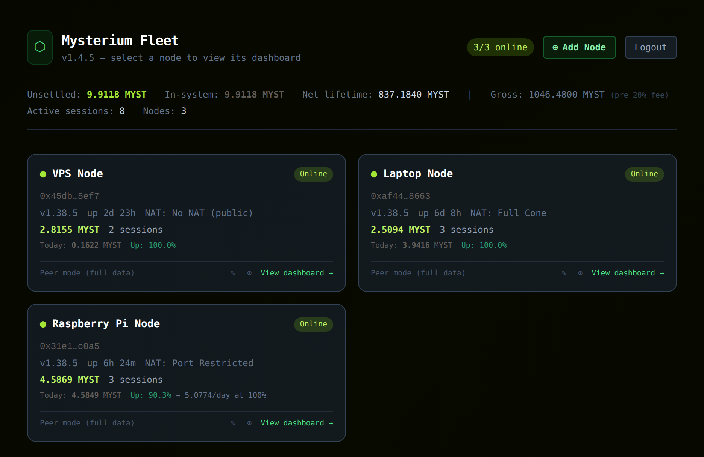
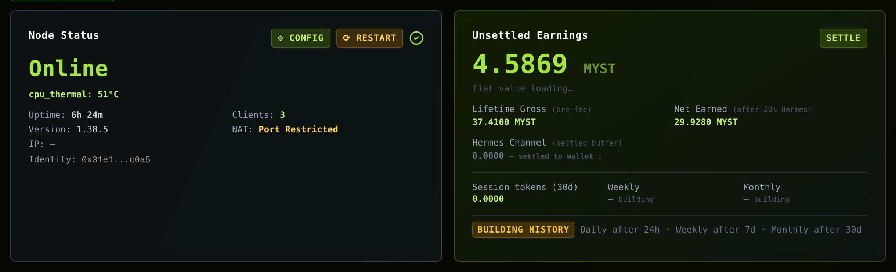
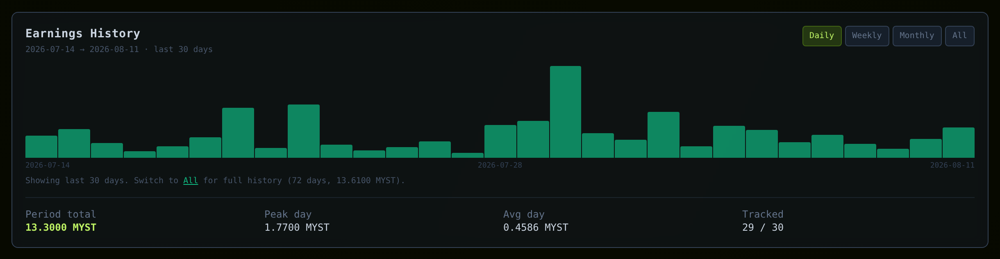
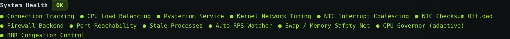

# Mysterium Node Toolkit

   

A monitoring and management dashboard for [Mysterium Network](https://mysterium.network) VPN node operators. It runs on your own machine: no account, no cloud backend, no telemetry. Your session history, earnings and consumer data live in local SQLite files. A handful of public APIs are contacted for prices, node quality and update checks — every one of them is listed under [Privacy](#privacy).



**Author:** Ian Johnsons — [github.com/IanJohnsons](https://github.com/IanJohnsons)
**License:** AGPL-3.0 — free to use and modify, modifications must be open source, not for commercial use without permission

---

## Before you start

Two questions decide how you install. Answer them first — it takes a minute and saves an hour.

### 1. Do you already have a Mysterium node?

| | What to do |
|---|---|
| **No node yet** | The installer offers to install one. Say yes, pick your distro's method, then continue below. |
| **Node already running here** | The installer detects it and skips straight to the toolkit. |
| **Node runs on another machine** | Install the toolkit on that machine too — the dashboard reads the node over localhost, not over the network. |

### 2. Which type of install?

| Type | Install it when | What you get |
|---|---|---|
| **1 — Full** | This machine runs a node and you want to watch it | Dashboard on port 5000, CLI, kernel tuning, firewall rules |
| **2 — Fleet master** | You have several nodes and want one screen for all of them | Everything in Type 1, plus a fleet view that reads your other machines |
| **3 — Lightweight** | This machine runs a node but is weak (Pi, small VPS) and a fleet master watches it | Backend only — no dashboard, no Node.js, minimal memory |

Running one node? Type 1, and you are done.

Running three, like a VPS, a laptop and a Pi? Type 1 on each, then Type 2 on whichever machine you want as the control screen. Type 3 exists for machines too small to build a frontend — it still reports everything, it just has no screen of its own.

### Requirements

- Linux — Debian, Ubuntu, Parrot, Fedora, Arch or Alpine
- x86_64, arm64 or armv7 — a Raspberry Pi 3, 4 or 5 is fine
- Python 3.8 or newer
- Node.js 18 or newer (Type 1 and 2; the installer offers to install it)
- `sudo` access
- Disk space grows with your history — the install itself is small, the databases are what accumulate

On a Raspberry Pi the installer reads `/proc/device-tree/model`, recognises the board and turns on **Pi mode**: the log level drops to WARNING to spare the SD card, and the web server runs a smaller thread pool. You can change it later under Settings.

Pi Zero and Pi 1 (armv6) have no Node.js 18 build, so they cannot run a dashboard. Type 3 works there — the node is monitored from a fleet master.

---

## Install

```bash
git clone https://github.com/IanJohnsons/mysterium-toolkit
cd mysterium-toolkit
sudo ./setup.sh
```

The installer is interactive and explains each step as it goes. It detects your node, asks which type you want, installs what is missing, and finishes with the address to open.

> Clone to a fixed directory name, without a version number in it. The autostart service points at this path — rename the directory and autostart breaks.

When it is done:

```
Dashboard: http://YOUR_IP:5000
API key:   shown once at the end of setup — save it
```

Open that address, paste the key, and you are in.

### Installing a second or third node

Repeat the steps above on that machine. Then, on the machine you want as your control screen, run `sudo ./setup.sh` again and choose **Type 2 — Fleet master**. Add the other machines from the dashboard with **Add Node**: their toolkit address (port 5000) and their API key, which is in `config/setup.json` on that machine.

Fleet traffic carries API keys, so send it over a private network. [Tailscale](docs/REFERENCE.md#tailscale) is the simplest way; the toolkit installs it for you if you want.

---

## Daily use

```bash
./start.sh      # control menu: start, stop, autostart, security, upgrades
./stop.sh       # stop the toolkit
./update.sh     # pull the latest version and restart
```

Never run `update.sh` with sudo. It repairs file ownership itself, and running it as root is what breaks that.

**Autostart:** `./start.sh` → option 8 (Type 1 and 2) or option 6 (Type 3). This installs a systemd service that starts after the node service and restarts on crash. On a lightweight install, start the backend manually once and check that it runs before enabling autostart.

```bash
systemctl status mysterium-toolkit
journalctl -u mysterium-toolkit -f
```

---

## What you see



**Node status, earnings and quality** across the top. Unsettled is what the node holds and has not paid out yet; lifetime gross is everything ever earned, before the 20% Hermes fee. The quality score comes from Mysterium's own discovery service, not from the toolkit.



**Earnings history** by day, week, month, or the full record. Built from ten-minute snapshots, so it survives node restarts and keeps going where the node API forgets. Traffic, session archive and per-service analytics sit below it.



**System health** checks thirteen subsystems that affect how much a node earns: connection tracking, CPU load balancing across cores, kernel network tuning, NIC settings, firewall backend, port reachability, and more. Each one can be fixed with one click, and locked so it survives a reboot. Targets scale with load rather than being fixed — a quiet node is not told to reserve memory it will never use.

Also included: node control (restart, settle, payment config), an on-chain wallet view via Polygonscan, a data manager with retention settings, fail2ban integration, eleven themes, and a terminal CLI.

---

## Reading the numbers

A few things on screen are abbreviated. The same explanations are in the dashboard under **? Help**.

**`Up: 90.3% → 5.0774/day at 100%`** — the node was reachable for 90.3% of the last 24 hours. The figure after the arrow is today's earnings divided by that uptime: what the day would have produced had the node been reachable throughout. It is not extra income, it is the cost of the downtime. At 100% uptime it would only repeat today's number, so it is left out.

**NAT types** describe how your router exposes the node, and they matter for earnings:

| Shown | Meaning |
|---|---|
| No NAT (public) | Public IP, no translation — typical on a VPS |
| Full Cone | Any host can reach the mapped port — best case behind a router |
| Restricted Cone | Reachable by hosts you contacted first — fine |
| Port Restricted | Works, but hole punching succeeds less often, so fewer sessions |
| Symmetric | A new mapping per destination — defeats hole punching, severely limits earnings |

UPnP or a manual port forward usually improves a restricted or symmetric result.

**Service types** — the node advertises four, and the toolkit shows friendly names: **Public** (`wireguard`, open to the whole network), **VPN** (`dvpn`, restricted to the Mysterium access policy), and two B2B services for business traffic, usually long-running and the largest earners.

**Peer mode (full data)** on a fleet card means that node runs the toolkit, so history and system metrics come across. **TequilAPI mode (live only)** means only the node API is reachable, with no history available.

---

## When something goes wrong

**Dashboard will not open.** Check that the service runs and that the port is open:

```bash
systemctl status mysterium-toolkit
curl -s localhost:5000/api/version
```

**A fleet node shows offline.** Open its card, click ✎, then **Test Connection**. The error names the cause. Two common ones: the TequilAPI field must be `http://` (the node API has no TLS), and the toolkit address is port 5000 while the node API is 4050.

**`update.sh` fails on a git error.** Almost always file ownership after something was run with sudo:

```bash
sudo chown -R $(whoami):$(whoami) ~/mysterium-toolkit
./update.sh
```

**Charts are empty or stop updating.** Check that the databases are writable:

```bash
curl -s localhost:5000/api/database-health | python3 -m json.tool
```

**Node quality is 0.00.** Usually port mapping. Check that UPnP works, or forward the node's UDP range manually. `./start.sh` → diagnostics reports what it can reach.

Still stuck? Open an issue with the output of `./bin/diagnose.sh`.

---

## Privacy

The toolkit sends no telemetry and reports nothing back to its author. There is no account and no cloud backend. It does contact a few public APIs over HTTPS, and two of them receive identifiers that are already public:

| Destination | What is sent | Why |
|---|---|---|
| `discovery.mysterium.network` | Your provider ID | Quality score, latency, bandwidth |
| `api.etherscan.io` | Your beneficiary address and your own API key | On-chain balance and settlements |
| `api.coinpaprika.com` | Nothing but your IP address | MYST price in USD |
| `api.frankfurter.dev` | Nothing but your IP address | USD to EUR conversion |
| `raw.githubusercontent.com` | Nothing but your IP address | Toolkit update check |
| `api.github.com` | Nothing but your IP address | Node release check |

Your provider ID is published by the node itself to the discovery service, and your beneficiary address is visible on the Polygon blockchain. Neither is a secret; they are listed so you know exactly what leaves the machine.

Never sent anywhere: session records, consumer addresses, earnings history, traffic figures, system metrics, logs, configuration files and API keys.

---

## More detail

Everything else — ports and firewall rules, kernel tuning, permissions and sudoers, TLS, Tailscale, fleet configuration, Ansible, Docker, database schemas and the CLI — is in **[docs/REFERENCE.md](docs/REFERENCE.md)**.

Version history is in [CHANGELOG.md](CHANGELOG.md).

---

## Built with

**Backend**

| Project | Author | License |
|---|---|---|
| [Flask](https://flask.palletsprojects.com) | Pallets Projects | BSD-3 |
| [flask-cors](https://github.com/corydolphin/flask-cors) | Cory Dolphin | MIT |
| [cheroot](https://cheroot.cherrypy.dev) | CherryPy team | BSD-3 |
| [psutil](https://github.com/giampaolo/psutil) | Giampaolo Rodolà | BSD-3 |
| [requests](https://requests.readthedocs.io) | Kenneth Reitz | Apache-2 |
| [python-dotenv](https://github.com/theskumar/python-dotenv) | Saurabh Kumar | BSD-3 |
| [SQLite](https://sqlite.org) | D. Richard Hipp | Public Domain |

**Frontend**

| Project | Author | License |
|---|---|---|
| [React](https://react.dev) and react-dom | Meta / React contributors | MIT |
| [Tailwind CSS](https://tailwindcss.com) | Tailwind Labs | MIT |
| [Vite](https://vitejs.dev) and @vitejs/plugin-react | Evan You / Vite contributors | MIT |
| [PostCSS](https://postcss.org) and Autoprefixer | Andrey Sitnik | MIT |
| [Lucide Icons](https://lucide.dev) | Lucide contributors | ISC |

**System tools the installer uses**

| Tool | Author | License |
|---|---|---|
| [vnstat](https://humdi.net/vnstat) | Teemu Toivola | GPL-2 |
| [ethtool](https://mirrors.edge.kernel.org/pub/software/network/ethtool) | Linux kernel project | GPL-2 |
| [miniupnpc](http://miniupnp.free.fr) | Thomas Bernard | BSD |
| [conntrack-tools](https://netfilter.org/projects/conntrack-tools) | Netfilter project | GPL-2 |
| [irqbalance](https://github.com/Irqbalance/irqbalance) | irqbalance contributors | GPL-2 |
| [lm-sensors](https://github.com/lm-sensors/lm-sensors) | lm-sensors project | GPL-2 |
| [curl](https://curl.se) | Daniel Stenberg | curl license |
| [fail2ban](https://www.fail2ban.org) | Cyril Jaquier and contributors | GPL-2 |
| [Tailscale](https://tailscale.com) | Tailscale Inc. | BSD-3 |

**External APIs** — see [Privacy](#privacy) for exactly what is sent to each

| Service | Used for | Key required |
|---|---|---|
| [Mysterium Discovery](https://discovery.mysterium.network) | Node quality, latency, bandwidth | No |
| [Etherscan / Polygonscan](https://etherscan.io) | On-chain balance and settlements | Yes, your own |
| [CoinPaprika](https://coinpaprika.com) | MYST price in USD | No |
| [Frankfurter](https://www.frankfurter.app) | USD to EUR, ECB rates | No |
| [GitHub API](https://docs.github.com/rest) | Node and toolkit update checks | No |

The Mysterium node itself is a separate project by [Mysterium Network](https://github.com/mysteriumnetwork/node) and is not distributed with this toolkit.

---

## Support the project

If the toolkit saves you time or helps you earn more MYST:

**MYST — Polygon network**
`0x032aA9dBAAa65035BF1e3965f1FdB1C82Af6819A`

---

## License

[AGPL-3.0](LICENSE) — free to use and modify. Modifications must be open source. Not for commercial use without permission.
